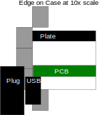
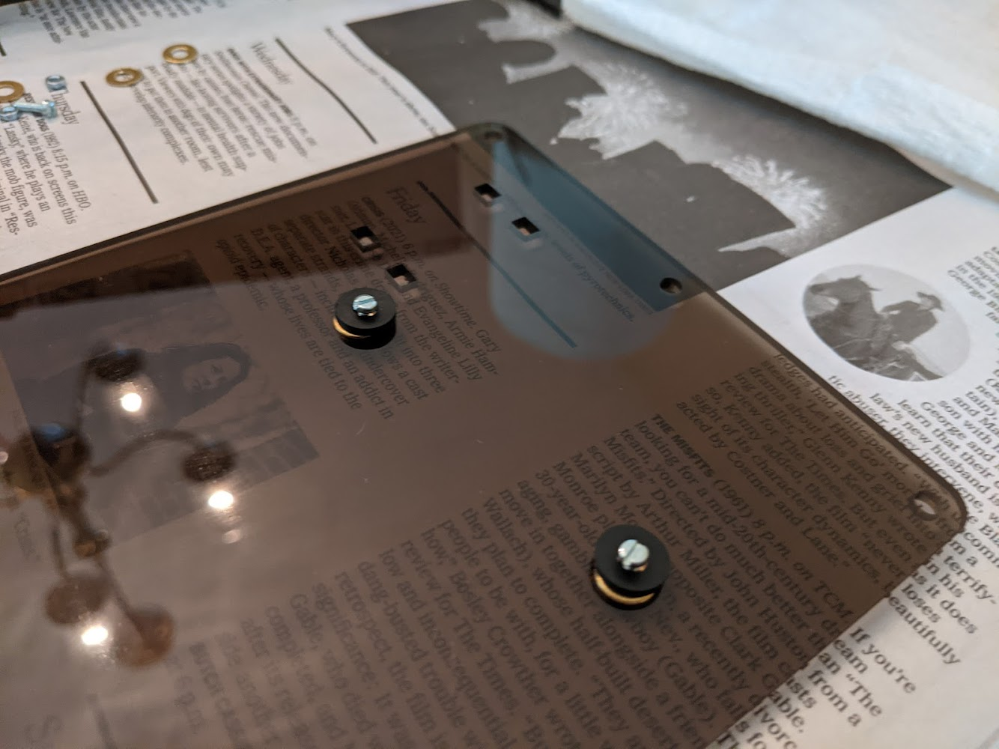
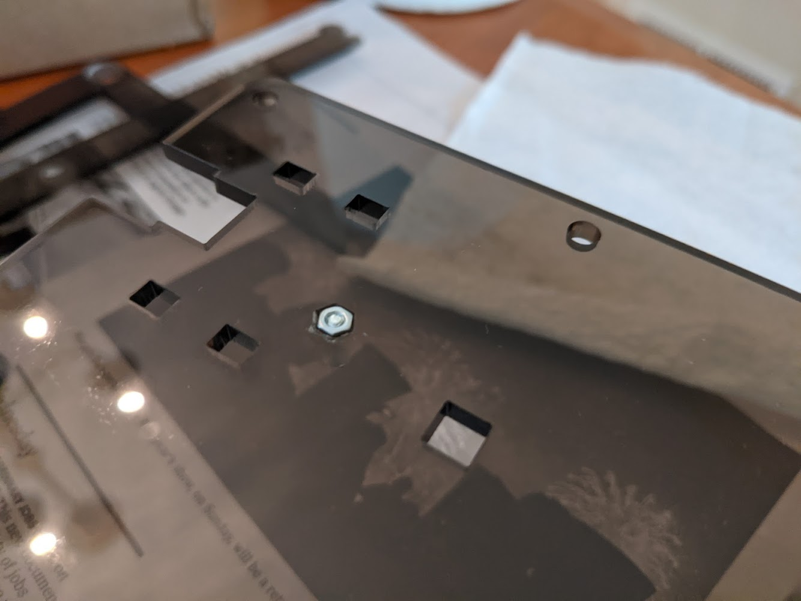

# Foxy 1 Keyboard Case
This is the case I designed for my foxy 1 keyboard. It is a 5 layer acrylic case I cut on my local maker space's laser cutter. Edge on it looks like this:

The middle two layers are cut in two pieces to save material.

I used a 'burger mount' which means the pcb sits on neoprene washers to cushion. The way I did this was to engrave away the shape of an m2 nut on the bottom layer. Then a nut is inserted in to that space. Then I use a long m2 screw inserted in to the top of the pcb through a neoprene and then a brass washer and in to the nut to hold the whole thing together. Here are some pictures:

The case is held together with brass chicago screws. I engraved a circle the size of the chicago screw head so it wouldn't sit so proud.

If you try to use these files, be sure to test your settings. Most of the trickier bits (the engravings and the feet) are in the file 'testcuts.svg'. The kerf is really sensitive for the feet; the rest of the project is fairly tolerant.

