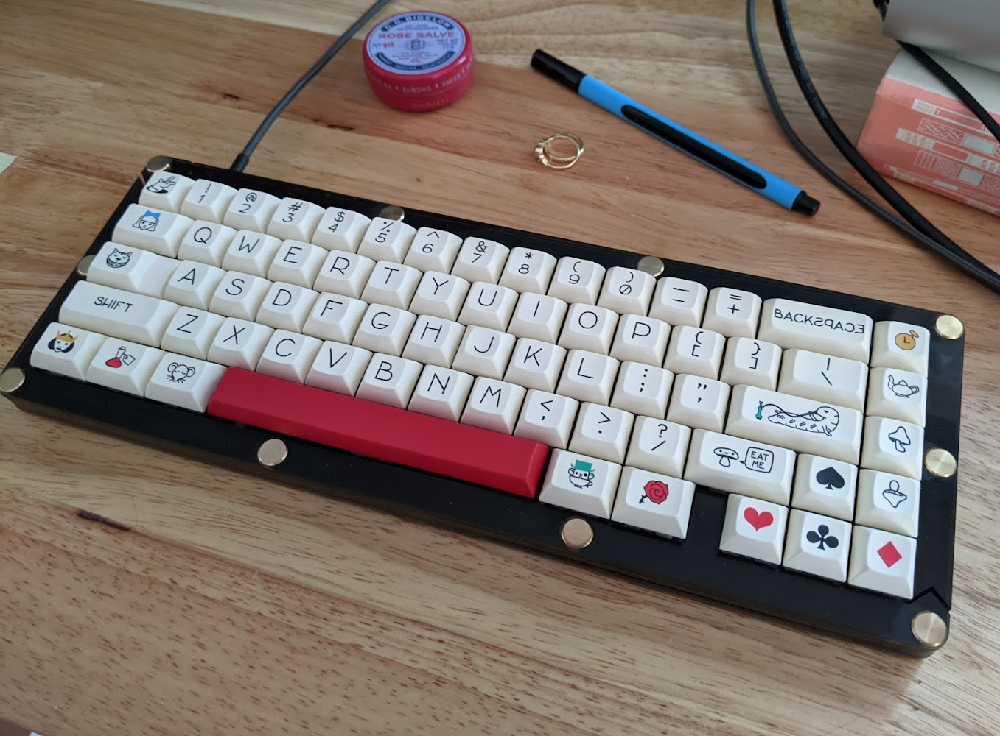

# Foxy 1 Keyboard

This is my first keyboard. It has a layout very similar to the White Fox, except that I am splitting up the spacebar to make layering a little more comfortable (at least, I think that's what it'll do). I'm making another keyboard for my wife who is using a more standard 65% layout.

I'm using a KBD67lite rev2 (not the MKII - this is the tray mount one) and I'll be trying a few different cases.

The layout file is designed in Keyboard Layout Editor. You can see [the layout over there](http://www.keyboard-layout-editor.com/#/gists/afc069881d7bfbbf893153100ea3f6c8)

* Case_AllAcrylic has files for an acrylic sandwich case (it has its own README).
* Firmware-standard has a json file for my wife's 'Aria' layout keyboard. It looks like this: 
* Firmware-split has a jason file for my keyboard, which is more like the 'Whitefox' layout plus a split keyboard. It is a Dvorak layout default. It looks like this:
